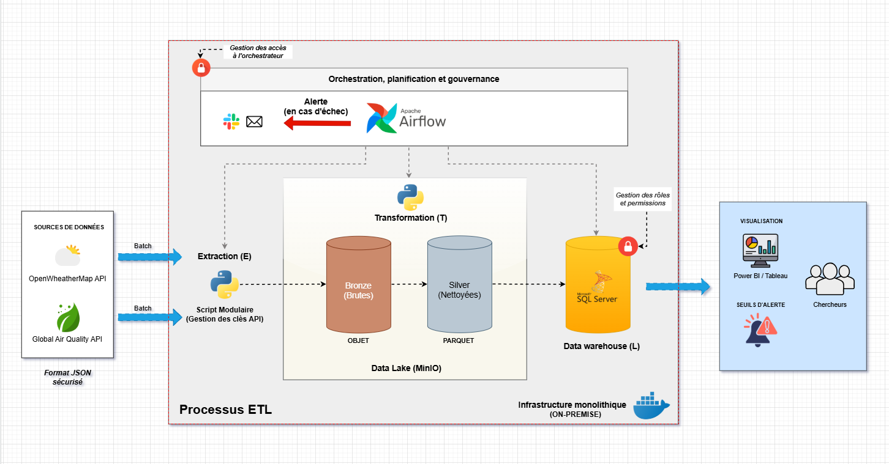
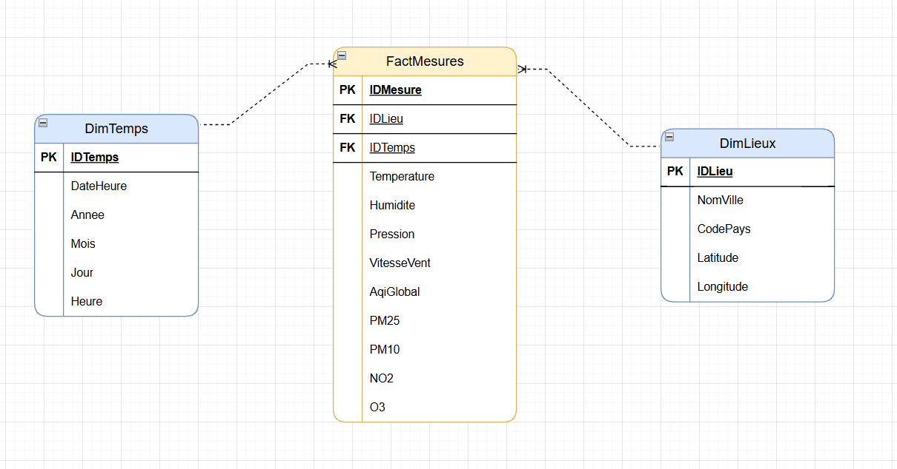

# GoodAir Pipeline

Pipeline ETL horaire pour le laboratoire GoodAir (TotalGreen).  
Collecte des données météorologiques (OpenWeatherMap) et de qualité de l'air (AQICN) pour les principales villes de France.

## Architecture

- **Orchestration** : Apache Airflow 3 (LocalExecutor)
- **Data Lake** : MinIO (couches Bronze / Silver)
- **Data Warehouse** : SQL Server 2022 (star schema — Gold)
- **Langage** : Python (pandas, pyarrow, SQLAlchemy, pyodbc)
- **Infra** : Docker Compose

## Structure du Projet

```
GoodAirPipeline/
├── dags/                  # DAGs Airflow
├── src/                   # Code source modulaire
│   ├── extract/           # Appels API → Bronze
│   ├── transform/         # Nettoyage & DQ → Silver
│   ├── load/              # Insertion SQL → Gold
│   ├── utils/             # Fonctions utilitaires
│   └── sql/               # Scripts .sql (MERGE, DDL)
├── tests/                 # Tests unitaires (Pytest)
├── config/
│   ├── cities_config.json
│   └── pipeline_config.yaml
├── .env.example           # Template des variables d'environnement
├── docker-compose.yml
├── Dockerfile             # Image Airflow custom (ODBC + dépendances)
├── pyproject.toml         # Dépendances (uv)
└── README.md
```

## Diagramme d'architecture de l'MVP



## Schéma en étoile



## Diagramme de Sequence du pipeline


## Architecture d'Airflow utilisée


## Démarrage Rapide

```bash
# 1. Copier et configurer les variables d'environnement
cp .env.example .env
# → Remplir les clés API et mots de passe dans .env

# 2. Lancer l'infrastructure
docker compose up -d

# 3. Accéder à Airflow
# http://localhost:8080 (airflow / airflow)
```

## Sources de Données

| Source | API | Données |
|--------|-----|---------|
| OpenWeatherMap | `/data/2.5/weather` | Température, Humidité, Pression, Vent |
| AQICN | `/feed/{city}/` | AQI, PM2.5, PM10, NO2, O3 |

## Équipe

Projet MSPR — EPSI (Bloc 3 RNCP36921)
