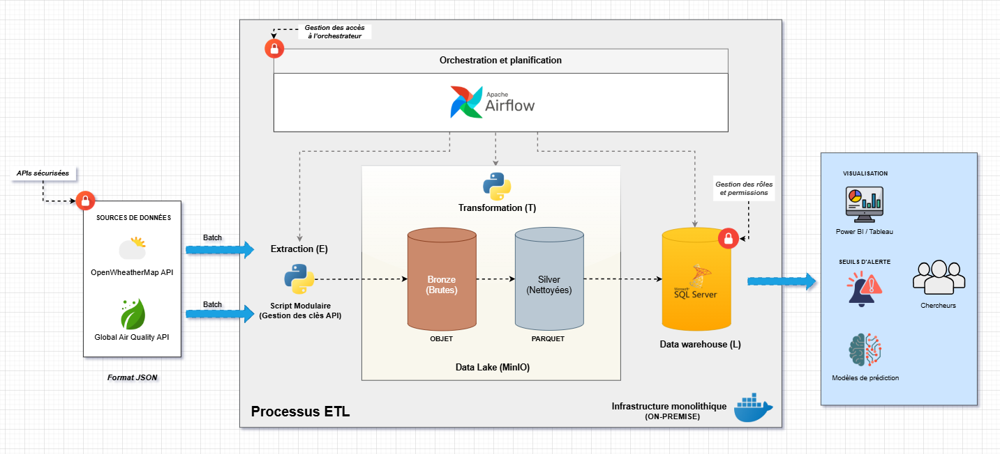
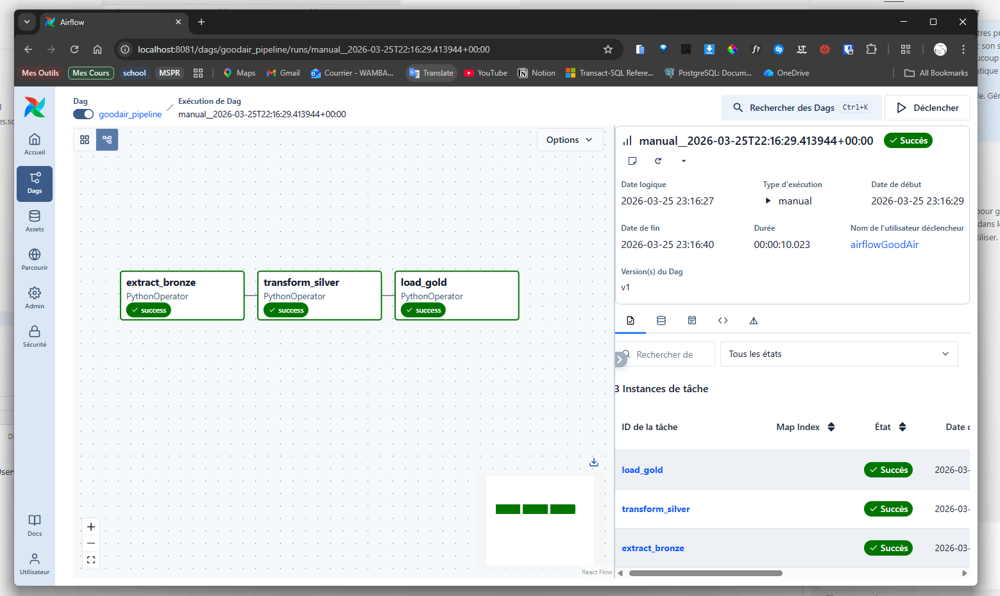
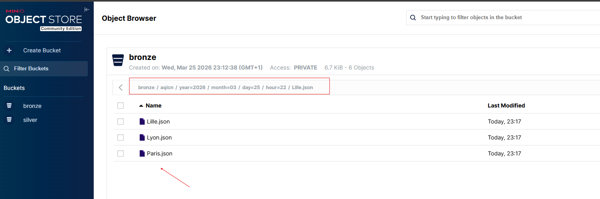
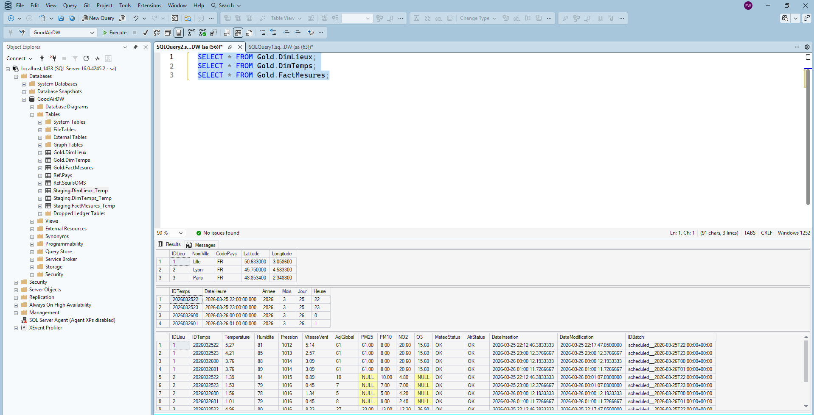
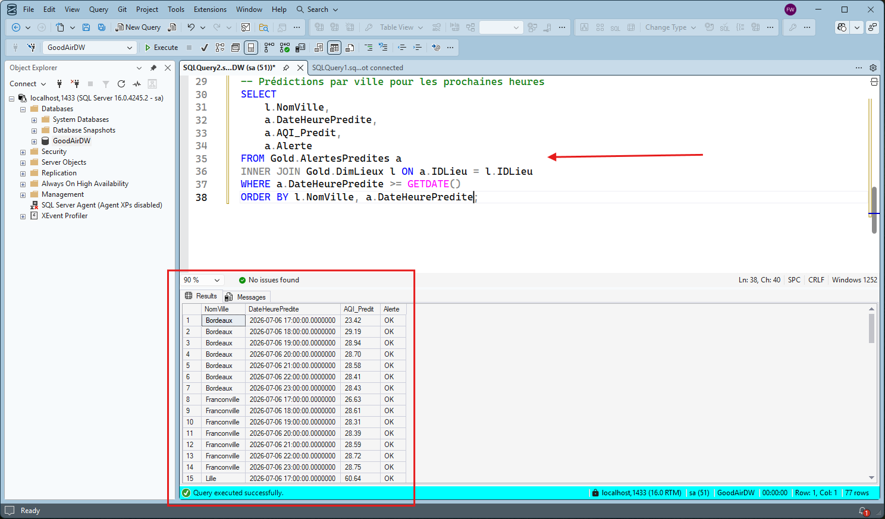
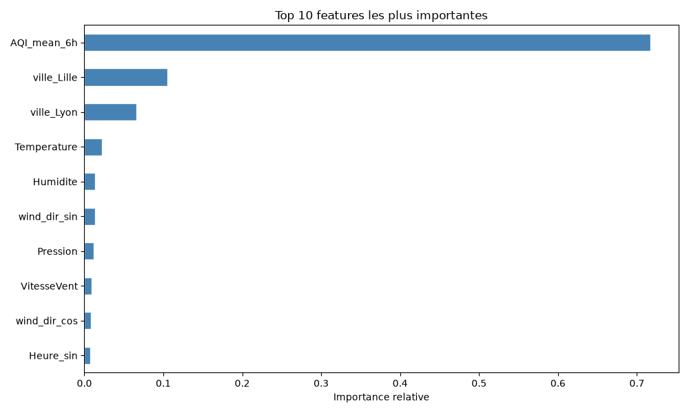
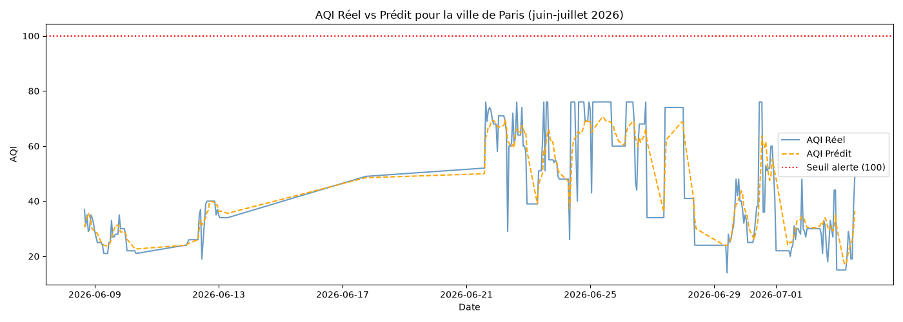
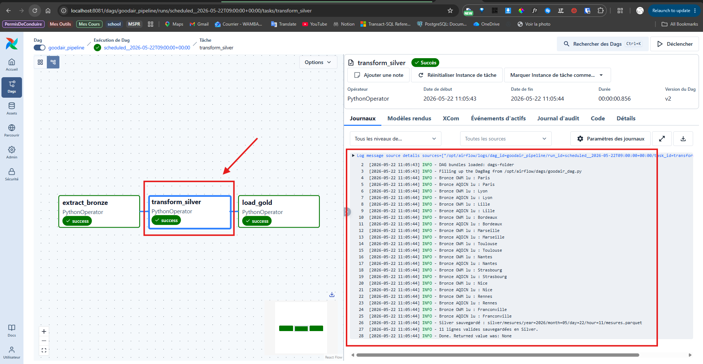
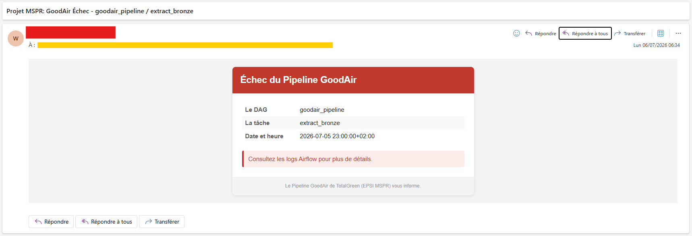
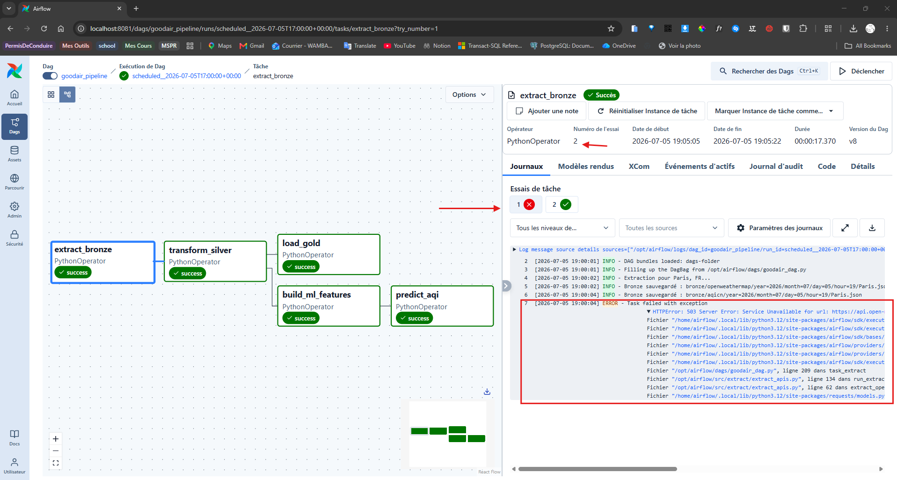

# GoodAir Pipeline

## Le problème

Le laboratoire GoodAir (TotalGreen) étudie la qualité de l'air en France. Ses chercheurs ont besoin de données météo et pollution fiables, historisées heure par heure, pour leurs analyses. Aujourd'hui, ces données existent dans des APIs publiques (OpenWeatherMap, AQICN) mais elles sont temps réel uniquement : si personne ne les capture, elles sont perdues.

Ce pipeline résout ce problème : il collecte automatiquement les données chaque heure, les nettoie, les stocke dans un Data Warehouse prêt pour les chercheurs, et prédit la qualité de l'air pour les 6 prochaines heures grâce à un modèle de machine learning.

---

## Le projet : Pipeline ETL horaire de qualité de l'air et modèles de prédiction ML

Un pipeline ETL horaire qui tourne en local via Docker, avec 5 étapes :

1. **Extract** - appelle 3 APIs (météo, qualité de l'air, prévisions météo) pour 11 villes françaises, stocke les réponses JSON brutes dans un Data Lake (MinIO)
2. **Transform** - aplatit les JSON, fusionne les deux sources, applique des règles de nettoyage métier (typage, gestion des NULL, détection de pannes partielles), écrit en Parquet
3. **Load** - insère dans des tables staging SQL Server, puis exécute un MERGE (UPSERT) vers le Data Warehouse final
4. **Prédiction ML** - construit les features depuis le Data Lake, prédit l'AQI pour les 6 prochaines heures via un modèle Random Forest et stocke les prédictions dans le Data Warehouse.
5. **Orchestration** - Apache Airflow 3 déclenche le tout automatiquement, gère les retries, envoie des alertes email en cas d'échec ou de pollution détectée

---

## Sources de données

| Source                                           | Type             | Données collectées                           |
| ------------------------------------------------ | ---------------- | -------------------------------------------- |
| [OpenWeatherMap](https://openweathermap.org/api) | Capteurs terrain | Température, Humidité, Pression, Vent        |
| [AQICN](https://aqicn.org/json-api/doc/)         | Capteurs terrain | AQI global, PM2.5, PM10, NO2, O3             |
| [Open-Meteo](https://open-meteo.com)             | Modèle numérique | Prévisions vent, nuages, précipitations à 6h |

---

## Pourquoi ces choix techniques

| Choix              | Pourquoi                                                                                                                                  | Alternative envisagée                                 |
| ------------------ | ----------------------------------------------------------------------------------------------------------------------------------------- | ----------------------------------------------------- |
| **LocalExecutor**  | 11 villes, 1 DAG horaire → pas besoin de workers distribués. Économise 3 conteneurs et ~1 Go de RAM                                       | CeleryExecutor (prévu si le volume augmente)          |
| **MinIO**          | S3-compatible, tourne en local, gratuit. Simule un vrai Data Lake sans dépendre du cloud                                                  | Stockage fichier local (pas S3-compatible)            |
| **Star schema**    | Une seule table de faits (1 ligne = 1 ville × 1 heure) simplifie les requêtes BI. Les chercheurs n'ont pas à faire de jointures complexes | Tables séparées météo/air (jointures obligatoires)    |
| **Pandas**         | Compatibilité native avec SQLAlchemy + pyodbc + fast_executemany. Volume < 1M lignes                                                      | Polars (envisagé en V2 si les volumes augmentent)     |
| **Time Bucketing** | On ignore les timestamps des APIs (décalages réseau) et on utilise l'heure Airflow. Garantit 1 ligne = 1 heure pile                       | Timestamp API (non déterministe)                      |
| **Config JSON**    | Ajouter une ville = ajouter une ligne, zéro code à modifier                                                                               | Table SQL Ref.VillesCibles (prévu en V2)              |
| **Random Forest**  | Robuste aux trous temporels, pas de normalisation requise, explicable via feature importance                                              | XGBoost (R²=0.81, moins stable sur 3 mois de données) |
| **Open-Meteo**     | Gratuit, sans clé API, fournit des prévisions jusqu'à 10h. Complète les données GoodAir pour la prédiction                                | Météo-France (API payante)                            |

---

## Les problèmes rencontrés et comment ils ont été résolus

> [!IMPORTANT]
>
> Voici les principaux défis techniques rencontrés lors du développement du pipeline, et les solutions mises en place pour les surmonter :
>
> - **Airflow 3 : "Invalid auth token"** — Bug connu ([GitHub #59373](https://github.com/apache/airflow/issues/59373)). Résolu en fixant `AIRFLOW__API_AUTH__JWT_SECRET` dans le docker-compose pour éviter des secrets JWT différents à chaque démarrage.
> - **NomVille incohérent entre APIs** — OpenWeatherMap renvoie "Paris", AQICN "Paris, Champs-Élysées". Solution : utiliser le nom du fichier config comme source unique de vérité.
> - **Pannes partielles d'API** — Certaines stations AQICN ne mesurent pas tous les polluants. Correction : ne marquer `FAILED` que si aucune métrique air n'est remplie.
> - **SQL Server consomme toute la RAM Docker** — Limité via `MSSQL_MEMORY_LIMIT_MB: 1024` + `mem_limit: 2g` dans le docker-compose.
> - **Décalage horaire IDTemps vs heure locale** — Airflow travaille en UTC même avec `Europe/Paris`. Ajout d'une conversion `to_paris_time()` dans le DAG et adaptation du SQL (`GETDATE() AT TIME ZONE ...`).
> - **Données dupliquées après redémarrage** — Deux runs simultanés peuvent collecter les mêmes données temps réel avec des IDTemps différents. Limitation liée aux APIs temps réel et à l'infra locale, pas de violation de clé.
> - **Timezone Open-Meteo** — Les timestamps retournés sont déjà en heure Paris mais Python les traitait comme UTC, créant un décalage de 2h. Résolu en conservant des `naive datetime` sans conversion.
> - **Alertes email Airflow 3** — `SmtpNotifier` du provider Airflow forçait SSL (port 465) au lieu de STARTTLS (port 587). Résolu en utilisant `smtplib` natif Python avec `starttls()` explicite.
> - **FK AlertesPredites sur IDTemps** — Les heures futures n'existent pas encore dans DimTemps. Résolu en supprimant la FK sur IDTemps et en utilisant `DateHeurePredite` directement en DATETIME2.

---

## Architecture



## Schéma en étoile


## Les taches dans Airflow



## Data Lake MinIO zones Bronze et Silver



## Data Warehouse SQL Server



## Table Gold.AlertesPredites - Prédictions ML



## Feature importance du modèle Random Forest



## Prévision vs Réel - Paris (juin-juillet 2026)



## Logs et métriques d'exécution Airflow



## Alerte email en cas d'échec du pipeline



## Retry automatique en cas d'échec



---

## Structure du Projet

```text
GoodAirPipeline/
├── config/
│   ├── cities_config.json
│   ├── pipeline_config.yaml
│   └── open_meteo_config.json          # nouveau - config pour l'API Open-Meteo
│
├── data/
│   ├── raw/
│   │   ├── open_meteo_historique/      # 1 CSV par ville (téléchargé manuellement)
│   │   │   ├── Paris.csv
│   │   │   ├── Lyon.csv
│   │   │   └── ...
│   │   └── goodair_historique/         # export SQL FactMesures pour EDA
│   │       └── export_FactMesures.csv
│   └── processed/                      # fichiers préparés par les notebooks
│       └── open_meteo_combined.csv
│
├── Rapports_ml/                        # rapports de performance des modèles ML
├── notebooks/
│   ├── 01_eda_goodair.ipynb            # EDA sur les données GoodAir (FactMesures)
│   ├── 02_eda_open_meteo.ipynb         # EDA sur les données Open-Meteo (historique)
│   ├── 03_eda_combined.ipynb           # EDA fusionnée (GoodAir + Open-Meteo)
│   ├── 04_data_preparation.ipynb       # Préparation : INNER JOIN, feature engineering,normalisation, split time series
│   ├── 05_modeling.ipynb               # Modélisation : entraînement et validation des modèles ML
│   └── 06_evaluation.ipynb             # Évaluation finale et sélection du meilleur modèle      
│
├── src/
│   ├── extract/
│   │   └── extract_apis.py             # modifié — ajout Open-Meteo de l'appel API et du stockage dans le Data Lake
│   ├── transform/
│   │   └── transform_silver.py         # inchangé
│   ├── load/
│   │   └── load_gold.py                # inchangé
│   ├── ml/
│   │   ├── feature_engineering.py      # ajout de la feature engineering pour le modèle ML
│   │   ├── predict.py                  # ajout de la prédiction AQI avec le modèle ML
│   │   └── models/
│   │       └── aqi_model.pkl
│   ├── sql/
│   │   └── 08_alertes_predites.sql     nouveau - DDL table Gold.AlertesPredites
│   └── utils/
│       └── connections.py              # inchangé
│
├── tests/
├── dags/
│   └── goodair_dag.py                  # modifié
├── docs/
├── .env.example
├── docker-compose.yml
├── Dockerfile
├── pyproject.toml
└── README.md
```

---

## Installation et lancement

```bash
# 1. Cloner et configurer
git clone https://github.com/Wambaforestin/GoodAirPipeline.git
cd GoodAirPipeline
cp .env.example .env
# Remplir les clés API et mots de passe dans .env

# 2. Construire et lancer
docker compose build
docker compose up airflow-init
docker compose up -d

# 3. Vérifier
docker compose ps    # Tout doit être "healthy"
```

## Accès aux services

| Service           | URL                   | Identifiants             |
| ----------------- | --------------------- | ------------------------ |
| Airflow           | http://localhost:8081 | (voir .env.example)      |
| MinIO Console     | http://localhost:9001 | (voir .env.example)      |
| SQL Server (SSMS) | localhost,1433        | sa / (voir .env.example) |

---

> [!IMPORTANT]
> Avant de lancer le pipeline, assurez-vous :
>
> - d'avoir rempli les clés API dans le fichier `.env`
> - d'être connecté à Internet pour que le pipeline puisse appeler les APIs
> - d'avoir exécuté le script `src/sql/01_init_goodair_dw.sql` dans SSMS pour créer la base de données
> - d'avoir activé le DAG `goodair_pipeline` dans l'interface Airflow

---

## Fuseau horaire

### Choix : Europe/Paris

Le pipeline est configuré pour que l'IDTemps corresponde à l'heure locale française. Quand il est 12h à Paris, l'IDTemps enregistré est `...12`.

**Implémentation (2 niveaux) :**

1. **Docker-compose** — l'interface Airflow affiche l'heure Paris :

   ```yaml
   AIRFLOW__CORE__DEFAULT_TIMEZONE: 'Europe/Paris'
   AIRFLOW__WEBSERVER__DEFAULT_UI_TIMEZONE: 'Europe/Paris'
   ```

2. **Code Python** — le `logical_date` d'Airflow est toujours en UTC en interne. Une fonction `to_paris_time()` dans `connections.py` convertit le datetime UTC en heure Paris avant de générer l'IDTemps.

### DST (Changement d'heure)

- **Heure d'été (dernier dimanche de mars)** : à 2h → 3h. Un trou d'1 heure possible dans les données.
- **Heure d'hiver (dernier dimanche d'octobre)** : à 3h → 2h. Conflit résolu par le retry Airflow et le MERGE.

Prochain changement : 25 octobre 2026.

---

## Requêtes SQL utiles

```sql
USE GoodAirDW;
GO

-- Les dernières mesures
SELECT TOP 11
    f.IDTemps AS [Créneau],
    l.NomVille AS [Ville],
    f.Temperature AS [Temp (°C)],
    f.Humidite AS [Humidité (%)],
    f.AqiGlobal AS [AQI],
    f.MeteoStatus AS [Statut Météo],
    f.AirStatus AS [Statut Air],
    f.DateInsertion AS [Date d''insertion]
FROM Gold.FactMesures f
INNER JOIN Gold.DimLieux l ON f.IDLieu = l.IDLieu
ORDER BY f.IDTemps DESC;

-- Prédictions AQI pour les prochaines heures
SELECT
    l.NomVille,
    a.DateHeurePredite,
    a.AQI_Predit,
    a.Alerte
FROM Gold.AlertesPredites a
INNER JOIN Gold.DimLieux l ON a.IDLieu = l.IDLieu
WHERE a.DateHeurePredite >= GETDATE()
ORDER BY l.NomVille, a.DateHeurePredite;

-- Alertes pollution détectées
SELECT
    l.NomVille,
    a.DateHeurePredite,
    a.AQI_Predit,
    a.DatePrediction
FROM Gold.AlertesPredites a
INNER JOIN Gold.DimLieux l ON a.IDLieu = l.IDLieu
WHERE a.Alerte = 'ALERTE'
ORDER BY a.DateHeurePredite;

-- Runs manuels vs schedulés
SELECT * FROM Gold.FactMesures WHERE IDBatch LIKE 'manual%';
SELECT * FROM Gold.FactMesures WHERE IDBatch LIKE 'scheduled%';
```

---

## Stack technique

- **Orchestration** : Apache Airflow 3 (LocalExecutor)
- **Data Lake** : MinIO (Bronze JSON / Silver Parquet / Silver Rejet)
- **Data Warehouse** : SQL Server 2022 (star schema + table de prédictions + Catalogue)
- **Machine Learning** : Random Forest Regressor (scikit-learn 1.9.0)
- **Langage** : Python 3.12
- **Infra** : Docker Compose
- **Gestionnaire de paquets** : uv

---

## Sécurité Airflow

Airflow 3 nécessite deux secrets partagés entre ses services Docker :

- **`AIRFLOW_FERNET_KEY`** - chiffre les données sensibles dans PostgreSQL :

  ```bash
  docker compose exec airflow-apiserver python -c "from cryptography.fernet import Fernet; print(Fernet.generate_key().decode())"
  ```

- **`AIRFLOW__API_AUTH__JWT_SECRET`** - signe les tokens JWT. Définir une valeur fixe dans le docker-compose.

---

## Maintenance

```bash
# Arrêter les services (données préservées)
docker compose down

# Reset complet (supprime toutes les données)
docker compose down --volumes --remove-orphans

# Reconstruire après modification du Dockerfile
docker compose build --no-cache

# Vérifier les logs d'un service
docker compose logs -f nom_service
```

---

## Prochaines étapes

- [x] Alertes email en cas d'échec du pipeline
- [x] Prédiction AQI (la qualité de l'air) à 6h via Random Forest
- [x] Couche rejet pour les données incomplètes (pour le pipeline et pour le ML)
- [ ] Tests unitaires (Pytest) et un pipe de CI (GitHub Actions) pour automatiser les tests à chaque push
- [ ] Création d'utilisateurs Airflow avec rôles distincts
- [ ] Migration du pilotage par config JSON vers table SQL Ref.VillesCibles (pour permettre aux chercheurs d'ajouter/supprimer des villes sans toucher au code)
- [ ]  Connexion Power BI / Tableau / Metabase au Data Warehouse: pour créer des KPIs et dashboards de suivi de la qualité de l'air pour les chercheurs
- [ ] Continuous Training du modèle automatiquement/manuellement tous les 3 mois
- [ ] Horizon de prédiction étendu à 24h

---

## Documentation complémentaire

- [Audit des sources de données](docs/AUDIT_SOURCES.md) - analyse détaillée des APIs OWM et AQICN
- [Audit de la nouvelle source Open-Meteo](docs/AUDIT_OPEN_METEO.md) - découverte, analyse du payload et mapping des variables
- [Stratégie de stockage dans MinIO](docs/STRATEGIE_STOCKAGE.md) - organisation, partitionnement, et sécurité des données dans MinIO.
- [Stratégie Data Warehouse](docs/STRATEGIE_DATAWAREHOUSE.md) - modélisation, schémas, MERGE et sécurité SQL Server.
- [Data Catalog](docs/DATA_CATALOG.md) - documentation des tables et colonnes.
- [Principes de développement](docs/PRINCIPE_DE_DEVELOPPEMENT_PIPELINE.md) - principes d'ingénierie, patterns et pratiques appliqués
- [Gestion du fuseau horaire](docs/CHANGEMENT_FUSEAU_HORAIRE.md) - explication détaillée du choix et de l'implémentation du fuseau horaire.
- [Gestion de la qualité des données](docs/QUALITE_DONNEES.md) - vérifications appliquées à chaque étape
- [Benchmark des outils du projet](docs/BENCHMARK_OUTILS.md) - comparaison des différentes technologies envisagées pour chaque composant du pipeline, et justification des choix finaux.
