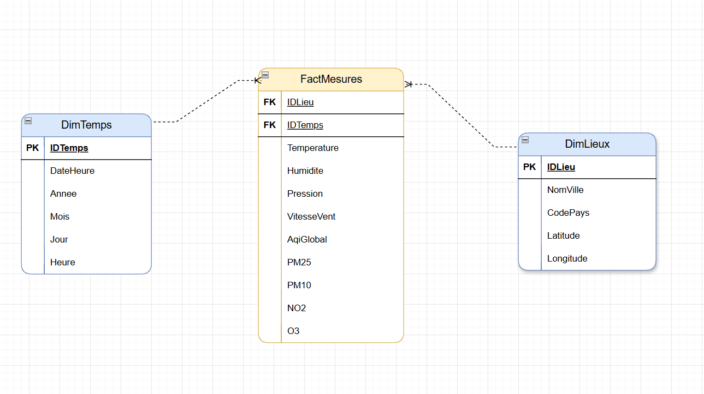
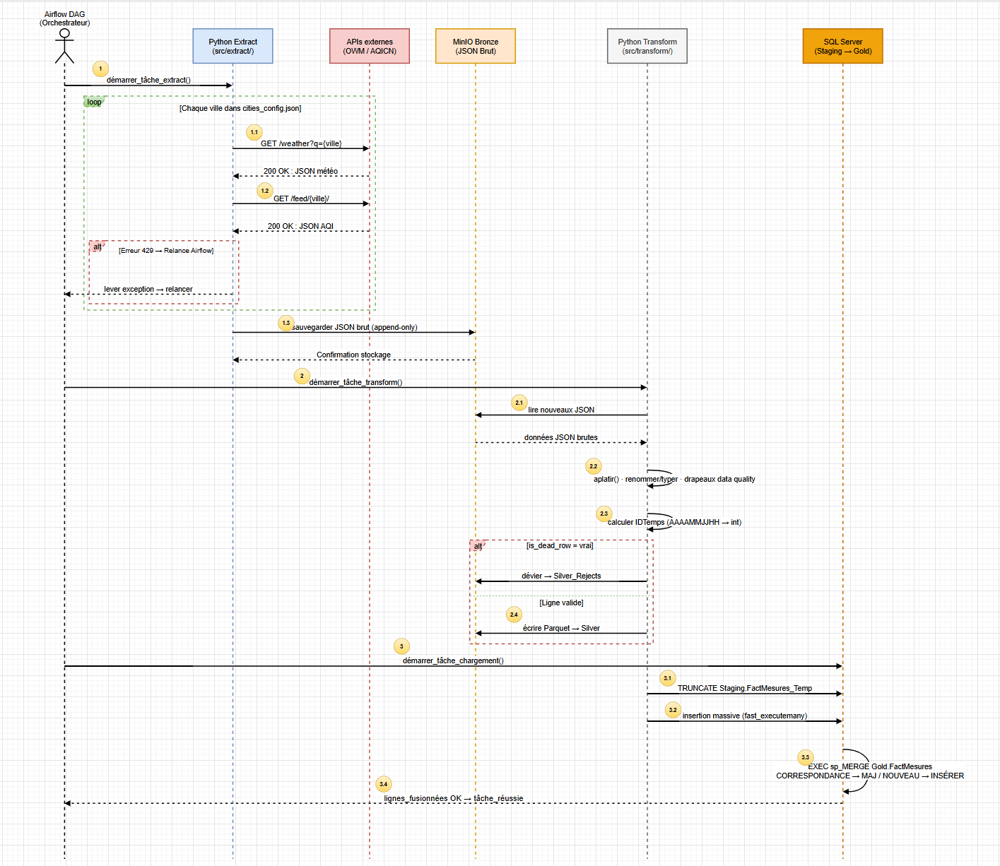
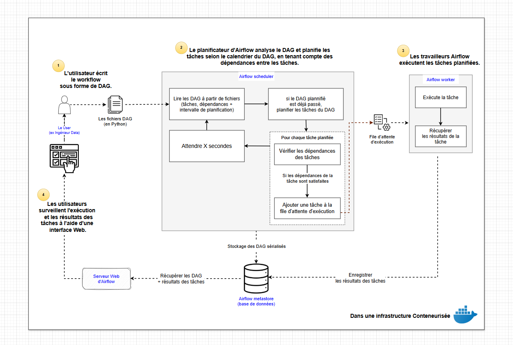

# GoodAir Pipeline

## Le problème

Le laboratoire GoodAir (TotalGreen) étudie la qualité de l'air en France. Ses chercheurs ont besoin de données météo et pollution fiables, historisées heure par heure, pour leurs analyses. Aujourd'hui, ces données existent dans des APIs publiques (OpenWeatherMap, AQICN) mais elles sont temps réel uniquement : si personne ne les capture, elles sont perdues.

Ce pipeline résout ce problème : il collecte automatiquement les données chaque heure, les nettoie, et les stocke dans un Data Warehouse prêt pour la visualisation (Power BI, Tableau).

## Le projet: Pipeline ETL horaire de qualité de l'air

Un pipeline ETL horaire qui tourne en local via Docker, avec 4 étapes :

1. **Extract** — appelle 2 APIs (météo + qualité de l'air) pour 10 villes françaises, stocke les réponses JSON brutes dans un Data Lake (MinIO)
2. **Transform** — aplatit les JSON, fusionne les deux sources, applique des règles de nettoyage métier (typage, gestion des NULL, détection de pannes partielles), écrit en Parquet
3. **Load** — insère dans des tables staging SQL Server, puis exécute un MERGE (UPSERT) vers le Data Warehouse final
4. **Orchestration** — Apache Airflow 3 déclenche le tout automatiquement, gère les retries, et logge chaque exécution

## Pourquoi ces choix techniques

| Choix              | Pourquoi                                                                                                                                  | Alternative envisagée                              |
| ------------------ | ----------------------------------------------------------------------------------------------------------------------------------------- | -------------------------------------------------- |
| **LocalExecutor**  | 10 villes, 1 DAG horaire → pas besoin de workers distribués. Économise 3 conteneurs et ~1 Go de RAM                                       | CeleryExecutor (prévu si le volume augmente)       |
| **MinIO**          | S3-compatible, tourne en local, gratuit. Simule un vrai Data Lake sans dépendre du cloud                                                  | Stockage fichier local (pas S3-compatible)         |
| **Star schema**    | Une seule table de faits (1 ligne = 1 ville × 1 heure) simplifie les requêtes BI. Les chercheurs n'ont pas à faire de jointures complexes | Tables séparées météo/air (jointures obligatoires) |
| **Pandas**         | Compatibilité native avec SQLAlchemy + pyodbc + fast_executemany. Volume < 1M lignes                                                      | Polars (envisagé en V2 si les volumes augmentent)  |
| **Time Bucketing** | On ignore les timestamps des APIs (décalages réseau) et on utilise l'heure Airflow. Garantit 1 ligne = 1 heure pile                       | Timestamp API (non déterministe)                   |
| **Config JSON**    | Ajouter une ville = ajouter une ligne, zéro code à modifier                                                                               | Table SQL Ref.VillesCibles (prévu en V2)           |

## Les problèmes rencontrés et comment ils ont été résolus

> [!IMPORTANT]
>
> Voici les principaux défis techniques rencontrés lors du développement du pipeline, et les solutions mises en place pour les surmonter :
>
> - **Airflow 3 : "Invalid auth token"** — Bug connu ([GitHub #59373](https://github.com/apache/airflow/issues/59373)). Résolu en fixant `AIRFLOW__API_AUTH__JWT_SECRET` dans le docker-compose pour éviter des secrets JWT différents à chaque démarrage.
> - **NomVille incohérent entre APIs** — OpenWeatherMap renvoie "Paris", AQICN "Paris, Champs-Élysées". Solution : utiliser le nom du fichier config comme source unique de vérité.
> - **Pannes partielles d'API** — Certaines stations AQICN ne mesurent pas tous les polluants. Correction : ne marquer `FAILED` que si aucune métrique air n'est remplie.
> - **SQL Server consomme toute la RAM Docker** — Limité via `MSSQL_MEMORY_LIMIT_MB: 1024` + `mem_limit: 2g` dans le docker-compose.
> - **Décalage horaire IDTemps vs heure locale** — Airflow travaille en UTC même avec `Europe/Paris`. Ajout d'une conversion `to_paris_time()` dans le DAG et adaptation du SQL (`GETDATE() AT TIME ZONE ...`). Suppression des données incohérentes pour garantir l'intégrité.
> - **Données dupliquées après redémarrage** — Deux runs simultanés peuvent collecter les mêmes données temps réel avec des IDTemps différents.Il s'agit d'une liitation liée aux APIs temps réel et à l'infra locale, mais pas de violation de clé.

## Architecture


## Schéma en étoile



## Diagramme de séquence du pipeline



## Architecture d'Airflow 3



## Structure du Projet

```text
GoodAirPipeline/
├── dags/                  # DAGs Airflow
├── src/
│   ├── extract/           # Appels API → Bronze (JSON brut dans MinIO)
│   ├── transform/         # Nettoyage & DQ → Silver (Parquet dans MinIO)
│   ├── load/              # Staging → MERGE → Gold (SQL Server)
│   ├── utils/             # Connexions DB, MinIO, config, logging
│   └── sql/               # Scripts DDL, MERGE, Data Catalog
├── tests/                 # Tests unitaires (Pytest)
├── config/
│   ├── cities_config.json # Villes à surveiller (pilotage par config)
│   └── pipeline_config.yaml
├── .env.example           # Template des variables d'environnement
├── docker-compose.yml     # Infra complète (Airflow + SQL Server + MinIO)
├── Dockerfile             # Image Airflow custom (ODBC + dépendances)
├── DATA_CATALOG.md        # Documentation des tables et colonnes
├── pyproject.toml         # Dépendances Python (uv)
└── README.md
```

## Quickstart

```bash
# 1. Cloner et configurer
git clone https://github.com/Wambaforestin/GoodAirPipeline.git
cd GoodAirPipeline
cp .env.example .env
# Remplir les clés API et mots de passe dans .env

# 2. Construire et lancer
docker compose build
docker compose up airflow-init
docker compose up -d

# 3. Vérifier
docker compose ps    # Tout doit être "healthy"
```

## Accès aux services

| Service           | URL                   | Identifiants     |
| ----------------- | --------------------- | ---------------- |
| Airflow           | http://localhost:8081 | (voir .env)      |
| MinIO Console     | http://localhost:9001 | (voir .env)      |
| SQL Server (SSMS) | localhost,1433        | sa / (voir .env) |

## Fuseau horaire

### Choix : Europe/Paris

Le pipeline est configuré pour que l'IDTemps (clé temporelle du Data Warehouse) corresponde à l'heure locale française. Quand il est 12h à Paris, l'IDTemps enregistré est `...12`.

**Implémentation (2 niveaux) :**

1. **Docker-compose** — l'interface Airflow et le scheduling affichent l'heure Paris :
  
   ```yaml
   AIRFLOW__CORE__DEFAULT_TIMEZONE: 'Europe/Paris'
   AIRFLOW__WEBSERVER__DEFAULT_UI_TIMEZONE: 'Europe/Paris'
   ```

2. **Code Python** — le `logical_date` d'Airflow est toujours en UTC en interne. Une fonction `to_paris_time()` dans `connections.py` convertit le datetime UTC en heure Paris avant de générer l'IDTemps. Les dates d'audit SQL (`DateInsertion`, `DateModification`) utilisent `GETDATE() AT TIME ZONE 'UTC' AT TIME ZONE 'Romance Standard Time'` pour rester cohérentes.

### Alternative non retenue : UTC avec affichage Paris

Garder le scheduling et les données en UTC, et ne changer que l'affichage de l'interface Airflow. C'est l'approche standard en entreprise pour les pipelines multi-pays. Non retenue ici car elle crée un décalage de 1 à 2 heures entre l'IDTemps et l'heure réelle française.

### DST (Changement d'heure)

Le DST se produit 2 fois par an en France :

- **Heure d'été (dernier dimanche de mars)** : à 2h → 3h. L'intervalle 2h-3h n'existe pas → un trou d'1 heure possible dans les données.
- **Heure d'hiver (dernier dimanche d'octobre)** : à 3h → 2h. L'intervalle 2h-3h existe deux fois → conflit résolu par le retry Airflow et le MERGE (UPSERT).

Prochain changement : 25 octobre 2026.

## Requêtes SQL utiles

```sql
USE GoodAirDW;
GO

SELECT * FROM Gold.DimLieux;
SELECT * FROM Gold.DimTemps;
SELECT * FROM Gold.FactMesures;

-- Runs manuels vs schedulés
SELECT * FROM Gold.FactMesures WHERE IDBatch LIKE 'manual%';
SELECT * FROM Gold.FactMesures WHERE IDBatch LIKE 'scheduled%';

-- Nombre de lignes dans FactMesures
SELECT COUNT(*) AS NbLignes FROM Gold.FactMesures;

-- Nombre de villes par créneau horaire
SELECT IDTemps, COUNT(*) AS NbVilles
FROM Gold.FactMesures
GROUP BY IDTemps
ORDER BY IDTemps;
```

## Stack technique

- **Orchestration** : Apache Airflow 3 (LocalExecutor)
- **Data Lake** : MinIO (Bronze JSON / Silver Parquet)
- **Data Warehouse** : SQL Server 2022 (star schema)
- **Langage** : Python 3.12 (pandas, pyarrow, SQLAlchemy, pyodbc)
- **Infra** : Docker Compose
- **Gestionnaire de paquets** : uv

## Sources de Données

| Source         | API                 | Données collectées                                     |
| -------------- | ------------------- | ------------------------------------------------------ |
| OpenWeatherMap | `/data/2.5/weather` | Température, Humidité, Pression, Vent, Coordonnées GPS |
| AQICN          | `/feed/{city}/`     | AQI global, PM2.5, PM10, NO2, O3                       |

## Sécurité Airflow

Airflow 3 nécessite deux secrets partagés entre ses services Docker :

- **`AIRFLOW_FERNET_KEY`** — chiffre les données sensibles dans PostgreSQL. Générer avec :

  ```bash
  docker compose exec airflow-apiserver python -c "from cryptography.fernet import Fernet; print(Fernet.generate_key().decode())"
  ```

- **`AIRFLOW__API_AUTH__JWT_SECRET`** — signe les tokens JWT pour la communication scheduler ↔ API server. Définir une valeur fixe dans le docker-compose.

Sans ces deux clés, les tasks échouent avec `Invalid auth token: Signature verification failed`.

## Maintenance

```bash
# Arrêter les services (données préservées)
docker compose down

# Reset complet (supprime toutes les données)
docker compose down --volumes --remove-orphans

# Reconstruire après modification du Dockerfile
docker compose build --no-cache
```

## Prochaines étapes

- [ ] Rôles et permissions SQL Server (Role_Chercheur, Role_Directeur, Role_RSSI)
- [ ] Alertes Slack/Email en cas d'échec du pipeline
- [ ] Création d'utilisateurs Airflow avec rôles distincts
- [ ] Tests unitaires (Pytest)
- [ ] Connexion Power BI / Tableau au Data Warehouse
- [ ] Migration du pilotage par config JSON vers table SQL `Ref.VillesCibles`
- [ ] Optimisation Polars si volumes > 1M lignes

## Équipe

Projet MSPR — EPSI (Bloc 3 RNCP36921)
